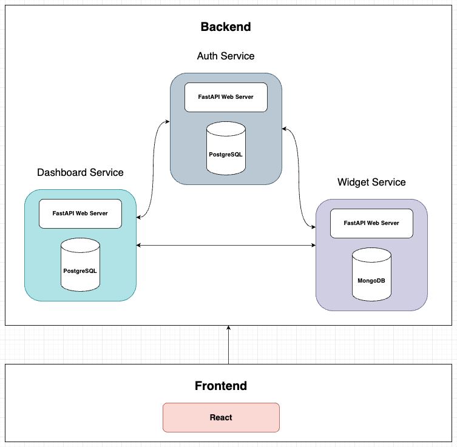

# Interactor

This project is a widget management system. It provides APIs to create, read, update, and delete widgets. The project is structured into several modules, each responsible for different aspects of the application.



## Table of Contents

- [Overview](#overview)
- [Installation](#installation)
- [Usage](#usage)
- [Documentation](#documentation)
- [Contributing](#contributing)
- [License](#license)

## Overview

The widget management system is designed to manage widgets efficiently. It includes the following modules:

- **API**: Handles the HTTP requests and responses.
- **Models**: Defines the data structures.
- **Services**: Contains the business logic.
- **CRUD**: Handles the database operations.
- **Config**: Manages the configuration settings.

## Installation

To install the project, follow these steps:

1. Clone the repository:
    ```sh
    git clone http://git.sharifict.ir/shahriarshm/interactor-backend.git
    ```
2. Navigate to the project directory:
    ```sh
    cd interactor-backend
    ```
3. Run using docker:
    ```sh
    docker compose up -d
    ```

## Usage

To run the application, use the following command:

```sh
docker compose up -d
```

## Contributing

Contributions are welcome! Please read the [Contributing Guidelines](./CONTRIBUTING.md) for more details.

## Documentation

The documentation for the project is available at [http://localhost:8000/docs](http://localhost:8000/docs).

Also you can read the [Documentation](./docs/README.md) for more details.

