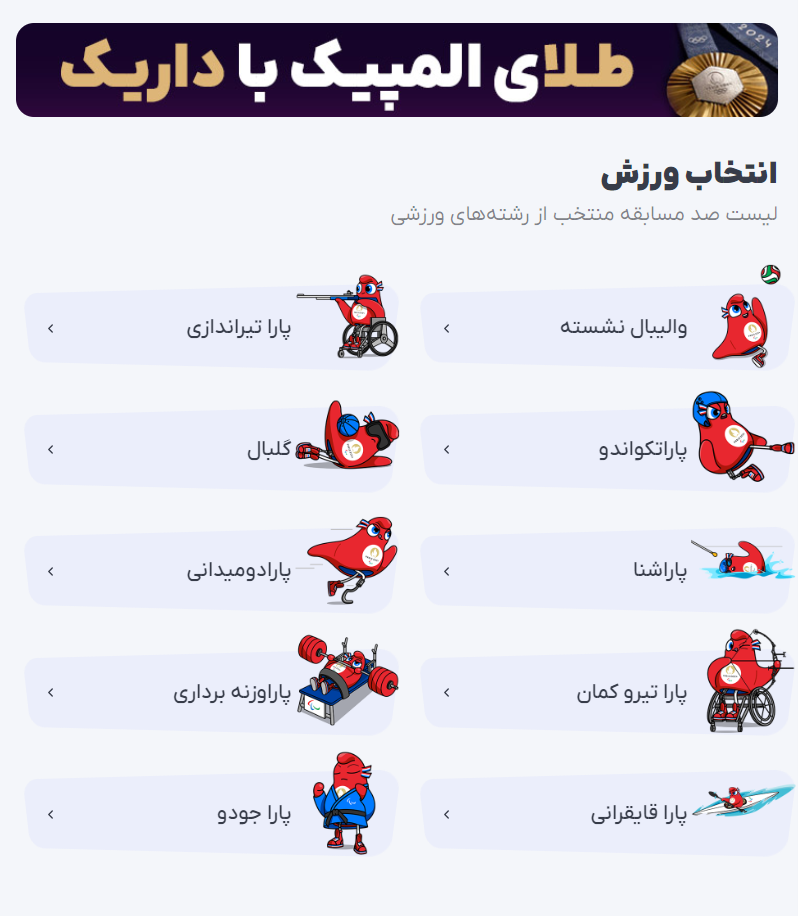

# Modern Advertising Project

Snapp, Tapsi, Digikala, Fidibo, Taaghche, Cinema Ticket, Iran Concert, and the late Bamilo and Reyhoon, along with many others, have been offering creative games and events on their websites for various occasions for years, aimed at attracting, retaining, and engaging users. The wheel of fortune is one of the simplest examples that most websites display during Black Friday, Yalda Night, founding anniversary, Nowruz, and other occasions to present their discounts in a more attractive manner.

Years ago, book reading campaigns for Zoodfood were one of the effective methods in line with the brand's social responsibility to promote reading culture and attract new audiences. The "Chand Khat" (A Few Lines) campaign, in addition to promoting reading culture and providing engaging content, offered discount codes from other companies to its customers in an integrated and coordinated manner.

Surely you have seen treasure hunt games, World Cup and Olympic prediction campaigns, and many other ideas on various websites and services over the years.

These creative games and events not only increase user engagement but also help increase sales and attract new customers. Due to their attractiveness and entertainment value, these types of campaigns encourage users to visit websites more often, spend more time on them, and make purchases.

Ultimately, these types of campaigns help businesses stand out in today's competitive world and establish closer relationships with their customers. Given the rapid changes in customer preferences and needs, taking initiative in designing creative games and events can be the key to success in the market.

But why doesn't everyone implement such campaigns? Perhaps time-consuming creativity, production costs, having the right team, etc., can be counted as reasons for this.

We intend to suggest that you implement a comprehensive system that allows different companies to display games, events, and campaigns provided by you as widgets on their websites.

We expect you to design the interactive advertising system described in this competition with the following quality:

1. Ability to provide discount codes, either as pre-generated codes or generated on-the-fly
2. Ability to provide the user's game score to the host for future services
3. Widget for displaying campaigns, games, etc.
4. Providing an exclusive profile of each user to the host, as a web service
5. Ability to provide a list of ready-made campaigns or create and offer custom games and campaigns by third parties (programmers and companies)
6. Use of your services by the host website user without the need to log in
7. Providing a leaderboard if needed by the host or appropriate to the campaign
8. Each campaign can include unique information that is important for the business to collect and process. For example, if a book reading campaign is offered, statistics on the number of lines read, average response time, and the number of book titles read, etc., should be made available to the host.
9. Ability to provide discount codes from other companies from a list of public codes (some companies will provide discount codes for other companies to use)
10. Providing a simple admin panel for the host (if you don't have enough time, provide web services and disregard the appearance)
11. Providing real-time and comprehensive statistics and information to the host, such as the number of visits, number of people present in the campaign, etc.
12. Creating a scalable system (you should be able to provide services to a large number of hosts and their users)
13. Adherence to security principles
14. Providing relevant and appropriate documentation, along with the solution architecture

Please note that additional explanations will be provided in the competition hall, followed by a Q&A session for a better understanding of the product.

The judges will be present alongside your team as business owners; you can ask them about any ambiguous issues.