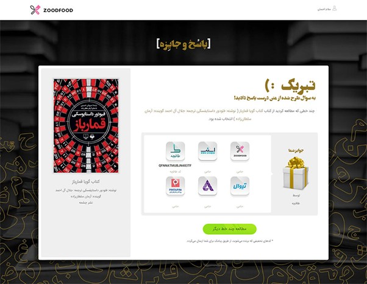
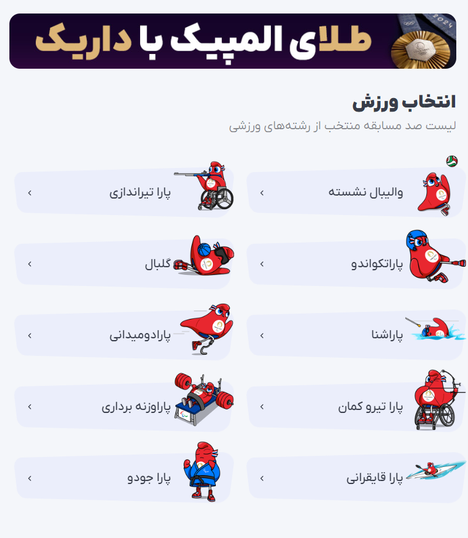

# پروژه تبلیغات نوین

اسنپ، تپسی، دیجی کالا، فیدیبو، طاقچه، سینما تیکت، ایران کنسرت و خدابیامرزان بامیلوو ریحون و بسیاری دیگر، سالهاست که به مناسبت‌های مختلف، در وبسایت خود بازی‌ها و رویدادهای خلاقانه‌ در جهت جذب، ماندگاری و تعامل با کاربر ارائه می‌دهند. گردونه شانس یکی از ساده‌ترین این موارد است که اکثر وبسایت‌ها در بلک فرایدی، شب یلدا، سالگرد تاسیس، نوروز و ... در وبسایت خود نمایش می‌دهند تا تخفیف‌های خود را به شکلی جذاب‌تر ارائه کنند.

سال‌ها پیش کمپین‌های کتابخوانی برای زود فود یکی از روش‌های موثر در راستای مسئولیت اجتماعی برند در ترویج فرهنگ مطالعه و جذب مخاطبان جدید بود. کمپین «چند خط» علاوه بر ترویج فرهنگ کتابخوانی و نیز ارائه مطالب جذاب، به صورت یکپارچه و هماهنگ با سایر شرکت‌ها، کدهای تخفیف آنها را نیز به مشتریان خود ارائه می‌داد.

  

مطمئنا بازی‌های گنج، کمپین‌های پیش‌بینی جام جهانی و المپیک و کلی ایده دیگر را در این سالها در وبسای‎تها و سرویس‌های مختلف دیده‌اید.

  

این بازی‌ها و رویدادهای خلاقانه‌ نه تنها باعث افزایش تعامل کاربران می‌شوند، بلکه به افزایش فروش و جذب مشتریان جدید نیز کمک می‌کنند. این نوع کمپین‌ها به دلیل جذابیت و سرگرم‌کنندگی، کاربران را ترغیب می‌کنند تا بیشتر به وبسایتها سر بزنند، وقت بیشتری در آن بگذرانند و به خرید بپردازند.

در نهایت، این نوع کمپین‌ها به کسب و کارها کمک می‌کند تا در دنیای رقابتی امروز متمایز شوند و ارتباط نزدیک‌تری با مشتریان خود برقرار کنند. با توجه به تغییرات سریع در سلیقه و نیازهای مشتریان، ابتکار عمل در طراحی بازی‌ها و رویدادهای خلاقانه می‌تواند کلید موفقیت در بازار باشد.

اما چرا همه چنین کمپین هایی اجرا نمیکنند؟ شاید زمانبر بودن خلاقیت، هزینه های تولید، داشتن تیم مناسب و ... را به توان دلایل این امر برشمرد.

در نظر داریم به شما پیشنهاد کنیم سامانه جامعی را پیاده کنید که شرکت های مختلف بتوانند بازی ها، رویدادها و کمپین های ارائه شده توسط شما را به صورت ویجت هایی در وبسایت خود نمایش دهند.

  
از شما انتظار داریم در این مسابقه نسبت به طراحی سامانه تبلیغات تعاملی بیان شده، به کیفیت زیر اقدام کنید.

1.  امکان ارائه کدهای تخفیف، به صورت کدهای تولید شده از قبل یا تولید آنی
2.  امکان ارائه امتیاز بازی کاربر به میزبان، جهت ارائه  خدمات آتی
3.  ویجت نمایش کمپین، بازی و ...
4.  ارائه پروفایل اختصاصی هر کاربر به میزبان، به صورت وب سرویس
5.  امکان ارائه لیست کمپین های آماده و یا ساخت و ارائه بازی ها و کمپین های اختصاصی توسط طرف سوم (برنامه نویسان و شرکت¬ها)
6.  استفاده از خدمات شما توسط کاربر وبسایت میزبان بدون نیاز به لاگین
7.  ارائه لیدربورد در صورت نیاز میزبان یا متناسب با کمپین
8.  هر کمپین میتواند شامل اطلاعات منحصر به خود باشد که جمع آوری و پردازش آنها برای کسب و کار مهم است. برای مثال اگر کمپین کتابخوانی ارائه شده است، آمار تعداد سطور مطالعه شده، مدت زمان میانگین پاسخگویی و تعداد عنوان کتاب مطالعه شده و ... میبایست در اختیار میزبان قرار بگیرد. 
9.  امکان ارائه کدهای تخفیف سایر شرکت ها از لیست کدهای عمومی (برخی از شرکت ها کدهای تخفیفی ارائه خواهند داد، تا سایر شرکت ها بتوانند از آنها استفاده کنند)
10.  ارائه پنل ادمین ساده برای میزبان (اگر وقت کافی ندارید، وب سرویس هایی ارائه دهید و از ظاهر کار صرف نظر کنید.)
11.  ارائه آمار و اطلاعات لحظه ای و جامع به میزبان مثل میزان بازدید، تعداد افراد حاضر در کمپین و ...
12.  ایجاد سامانه مقیاس پذیر (شما باید بتوانید به تعداد زیادی میزبان و کاربران آنها خدمات ارائه کنید)
13.  رعایت اصول امنیتی
14.  ارائه داکیومنت های مرتبط و مناسب، به همراه معماری راه حل

توجه داشته باشید، توضیحات تکمیلی در سالن مسابقه ارائه خواهد شد و پس از آن جلسه پرسش و پاسخ برای درک بهتر محصول برگزار خواهد شد.

داورها به عنوان مالک کسب و کار در کنار تیم شما حضور خواهند داشت، میتوانید موارد مبهم را از آنها بپرسید.